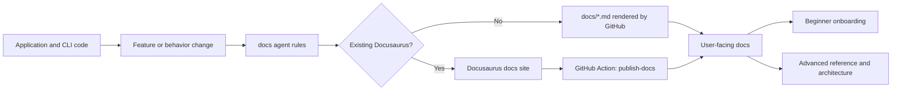
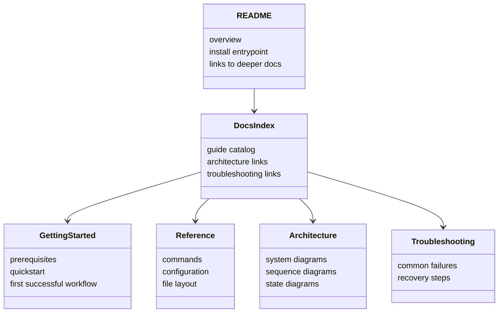
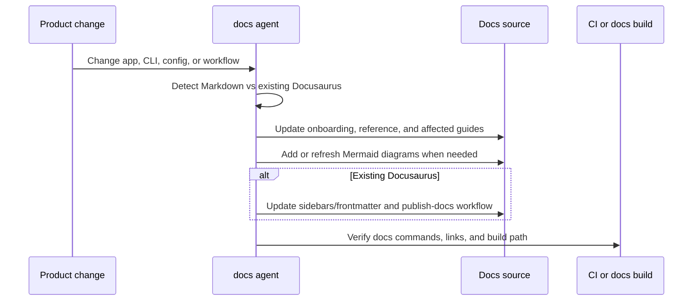

# Documentation Agent

The **docs** agent keeps repository documentation aligned with the shipped application, CLI, configuration, and operating model.

## What It Sets Up

The docs agent installs a documentation rule that:

- defaults to a GitHub-readable Markdown documentation set under `docs/`
- detects existing Docusaurus usage and preserves it instead of replacing it
- requires a `publish-docs` GitHub Actions workflow when Docusaurus is in use
- treats docs updates as part of every product change, not optional cleanup
- requires diagrams where they materially improve understanding

## Documentation Strategy

Use plain Markdown unless the repository already uses Docusaurus or the user explicitly requests Docusaurus.

Docusaurus detection signals include:

- `docusaurus.config.js` or `docusaurus.config.ts`
- `sidebars.js` or `sidebars.ts`
- `@docusaurus/*` dependencies in `package.json`
- a matching `docs/`, `blog/`, `src/pages/`, or `static/` site structure

If Docusaurus is present:

- keep the existing site architecture
- update page frontmatter and sidebars along with the content
- maintain a `publish-docs` workflow in `.github/workflows/`

If Docusaurus is not present:

- keep the docs as Markdown files viewable directly in GitHub
- use `docs/README.md` as the docs landing page
- organize onboarding, reference, architecture, and troubleshooting as normal Markdown pages

## What Good Documentation Looks Like

- New users can reach a working setup quickly from the README and getting-started docs.
- Advanced users can find exact flags, config fields, workflows, limitations, and troubleshooting steps.
- Code, commands, examples, and documentation use the same terminology.
- App changes, CLI changes, and config changes update docs in the same pull request.

## Diagram Expectations

Use Mermaid where it clarifies the system.

- Add a high-level system diagram for non-trivial apps or workflows.
- Add a data or configuration model diagram when the project has meaningful entities or relationships.
- Add sequence diagrams for workflows that are easier to explain as a timeline.
- Add state diagrams when lifecycle transitions matter.

## System Diagram

## Documentation Content Model

## Update Sequence

## Prompts to Improve Your App

- **"Document this new CLI command and update the getting-started guide"** — CLI + onboarding sync
- **"Add a system overview page with a Mermaid diagram"** — architecture docs
- **"We already use Docusaurus; update the site and add a publish-docs workflow"** — existing site maintenance
- **"Create reference docs for our config schema and include a Mermaid data model"** — config reference
- **"Update troubleshooting docs for this deployment failure mode"** — operator guidance
